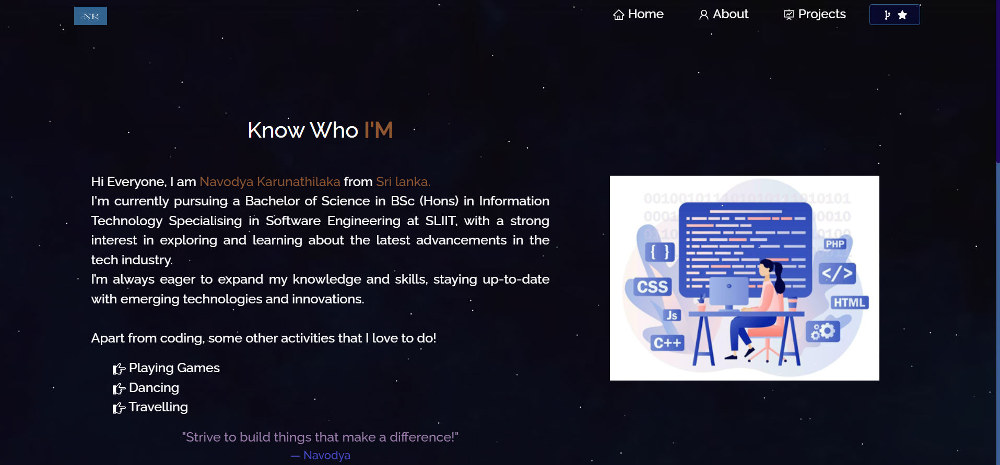

  🚀 Portfolio Website - v2.0
</h2>

  

 

  A responsive multi-page developer portfolio showcasing my projects, skills, and experiences.

---

## 🔨 Built With

This project was built using these technologies:

- ⚛️ **React.js**
- 🔧 **Node.js** 
- 🚀 **Express.js** –
- 🎨 **CSS3** 
- 💻 **VS Code**
- 🌐 **Vercel** 

---

## ✨ Features

- 📖 **Multi-Page Layout** – Seamless navigation between pages
- 🎨 **Styled with React-Bootstrap and CSS** – Easily customizable components and colors
- 📱 **Fully Responsive** – Looks great on desktop, tablet, and mobile

---

## 🛠 Installation and Setup Instructions

1. Installation: `npm install`

2. In the project directory, you can run: `npm start`

Runs the app in the development mode.  
Open [http://localhost:3000](http://localhost:3000) to view it in the browser.  
The page will reload if you make edits.

